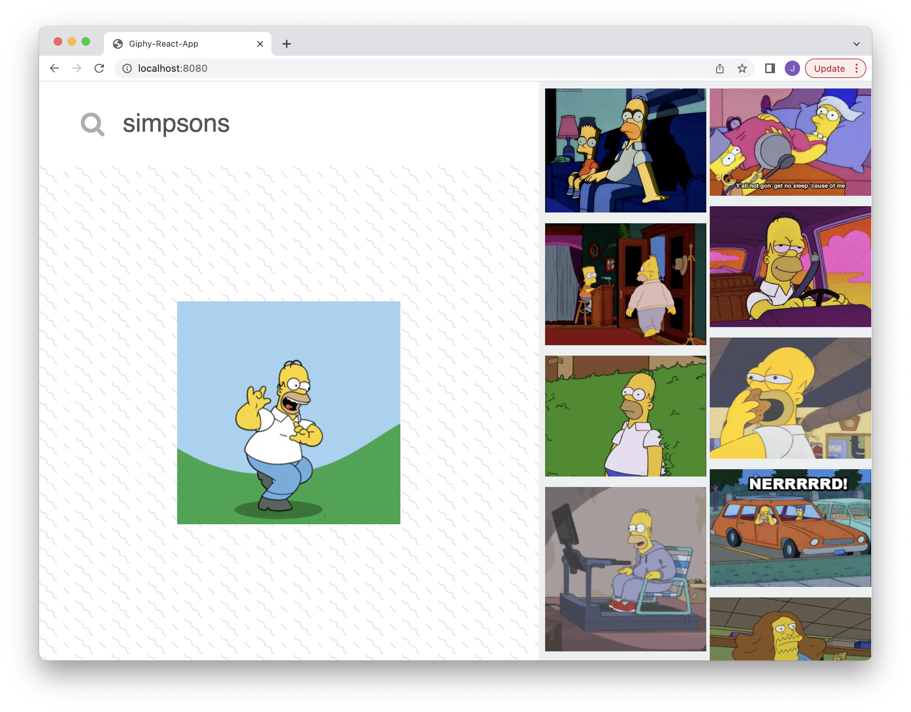

# Giphy-Search-React

Simple React app that uses Giphy's API to search for and view GIFS.

 This repo contains two branches which builds the same app differently.

**Master** - Uses both functional and class components.

**React-Hook-Giphy** - Uses functional components and React Hooks.

---



App home: https://tsunghotang.github.io/giphy-react/


---

## Built With
- [React](https://reactjs.org/) - Front-end
- [Giphy API](https://yarnpkg.com/package/giphy-api)
- [Webpack](https://yarnpkg.com/package/webpack)
- [Babel](https://yarnpkg.com/package/@babel/core)
- [gh-pages](https://yarnpkg.com/package/gh-pages) - Deployment


---
### Setup
1. Install JS packages
```
yarn install
```

2. Get a free API key from https://developers.giphy.com/

3. Add the API key to the `GIPHY_API_KEY` variable located on line 11 in `src/app.jsx`


### Scripts
To start the local Webpack Dev Server (usually on port `8080`):

```bash
yarn start
```

To lint all JavaScript files in the `src` folder:

```bash
yarn lint
```

To build and deploy your app to `gh-pages` branch on the GitHub repo:

```bash
yarn deploy
```
---
# Todo
* Improve accessibility - styling for focusable elements.
* Load more results and introduce lazy loading or infinite scroll
